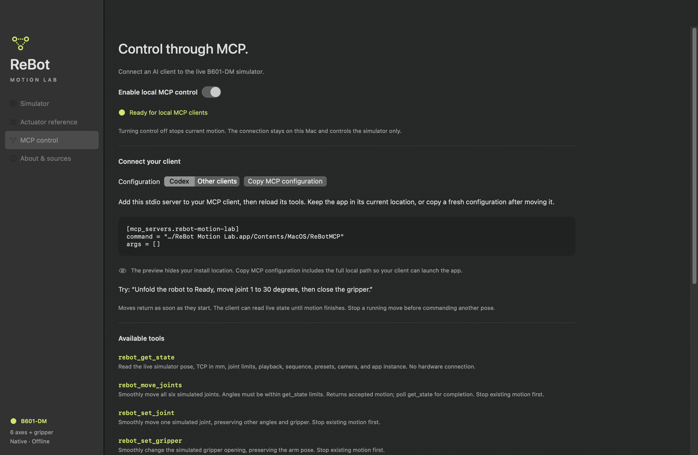

# Control ReBot Motion Lab through MCP

Version 1.5 includes **ReBotMCP**, a native universal macOS executable that exposes the running Swift simulator to an MCP client over standard input/output. It is bundled inside `ReBot Motion Lab.app/Contents/MacOS/ReBotMCP`. No Python, Node, API key, or package installation is required to use the server.

Open the app's **MCP control** page to enable/disable access, copy a configuration with the current executable path, and inspect recent commands. MCP control is enabled by default; turning it off stops motion and saves that preference. Only one app instance provides MCP control at a time.

The on-screen preview hides your install directory for screen sharing. Use **Copy MCP configuration** to copy the working configuration; the clipboard includes the full local path required to launch the helper.



## Connect Codex

Register the bundled executable using the full path to your copy of the app:

```sh
codex mcp add rebot-motion-lab -- "/absolute/path/ReBot Motion Lab.app/Contents/MacOS/ReBotMCP"
```

Alternatively add this server to your Codex configuration, replacing the command path:

```toml
[mcp_servers.rebot-motion-lab]
command = "/absolute/path/ReBot Motion Lab.app/Contents/MacOS/ReBotMCP"
args = []
```

Reload MCP tools in your client after registration. `codex mcp get rebot-motion-lab` shows the saved entry. The command syntax and configuration format follow the [official Codex MCP documentation](https://learn.chatgpt.com/docs/extend/mcp?surface=cli).

## Other stdio MCP clients

Use **Copy MCP configuration** in the app. The configuration has this shape:

```json
{
  "mcpServers": {
    "rebot": {
      "command": "/absolute/path/ReBot Motion Lab.app/Contents/MacOS/ReBotMCP",
      "args": []
    }
  }
}
```

The helper opens its containing app on the first tool call if no simulator is listening. If the app is loading, read state until `scene_ready` is true. If control was turned off, enable it in the app. Moving the app requires updating the command path. To require an already-running simulator, set `REBOT_MCP_NO_LAUNCH=1` in the server environment.

## Tools

| Tool | Purpose |
| --- | --- |
| `rebot_get_state` | Live joint angles, gripper, TCP, limits, playback, waypoints, presets, view, app instance ID, and command revision. |
| `rebot_move_joints` | Smooth six-joint motion with optional gripper opening. |
| `rebot_set_joint` | Smoothly change one joint, numbered 1–6. |
| `rebot_set_gripper` | Set opening from 0 to 90 mm. |
| `rebot_move_to_position` | Position-only IK using X/Y/Z in mm in the robot base frame. |
| `rebot_apply_preset` | Folded, Ready, Reach, or Upright. Folded also closes the gripper. |
| `rebot_playback` | Explicit play, pause, resume, stop, or reset actions. |
| `rebot_set_speed` | Sequence playback speed, 10–100%. |
| `rebot_add_waypoint` | Append the current stopped pose with an optional name. |
| `rebot_set_sequence` | Validate and replace the whole sequence atomically, up to 1,000 poses. |
| `rebot_clear_sequence` | Clear the waypoint sequence while stopped. |
| `rebot_set_view` | Camera preset, grid, tool axes, trace, and trace clearing. |

Resources: `rebot://state` provides the live state as JSON; `rebot://actuators` provides the full bundled actuator settings reference as Markdown. Reference content is read-only and does not configure simulated or physical actuators.

## Motion workflow

1. Read `rebot_get_state` and its joint limits.
2. If playback is active or paused, or `manual_motion` is true (a slider is being dragged), explicitly stop it before commanding another pose.
3. Send a motion tool. The result reports `accepted: true` and the current state; **acceptance does not mean a playback target has been reached**.
4. Poll state, typically every 0.25–0.5 seconds, until playback becomes `stopped` and `manual_motion` is false, then inspect the final pose. Pause and stop can be issued during playback; Stop also ends slider tracking.

State always reports actual rendered joint angles, gripper opening, and TCP. Interactive sliders apply that pose immediately. While a slider is held, `manual_motion` is true and `manual_target` matches the live pose; otherwise `manual_target` is null. New pose or sequence commands are rejected while a slider is tracking or playback is active.

Example prompts: “Unfold to Ready, then rotate the base to 30 degrees.” “Read the tool position and move it 10 mm upward.” “Save this pose as Pick, close the gripper, and save another waypoint.” “Fold the robot back to its startup position.”

Angles are degrees; positions and gripper opening are millimeters. Invalid types, unknown fields, out-of-range angles, and failed IK return tool errors without starting motion. MCP moves use the simulator's eased interpolation and nominal peak limits of 60°/s and 60 mm/s. Sequence speed changes apply to sequence playback; individual pose commands use nominal speed. Navigating away from the Simulator pauses playback and ends slider tracking. Keep the simulator view visible while running trajectories.

Waypoints are session data. Export a trajectory from the app to keep them. `rebot_set_sequence` replaces all waypoints, while reset preserves the sequence and returns the arm immediately to folded startup.

## Local transport and scope

The MCP client launches ReBotMCP as a subprocess. Its stdout contains only newline-delimited JSON-RPC, following the [MCP stdio transport](https://modelcontextprotocol.io/specification/2025-11-25/basic/transports). The server supports initialization, ping, tool discovery/calls, resource discovery/reads, and the initialized notification. It does not advertise subscriptions or prompts. Protocol negotiation supports 2025-11-25, 2025-06-18, 2025-03-26, and 2024-11-05; structured tool results are included for versions that support them.

The helper talks to the GUI through a Unix domain socket in a private per-user temporary directory. The directory is mode 0700, the socket mode 0600, both ends verify the peer's user ID, and an instance lock prevents two apps from taking over the same socket. There is no HTTP listener or external network endpoint. IPC messages are bounded to 1 MiB and have I/O timeouts. If a connection fails after a command was sent, the helper does not retry it automatically; read state before retrying.

These tools operate the **kinematic simulator only**. The app has no robot hardware connection, CAN transport, self-collision detection, or actuator dynamics model. It enforces a solid base plane for the complete moving geometry, including both gripper fingertips. Targets below the floor are rejected; an obstructed path stops at contact. Read `status` and actual pose to distinguish contact from reaching the requested target. State includes the floor height and minimum moving-mesh height.

## Developer checks

```sh
bash scripts/swift-local.sh test
bash scripts/build-app.sh ./dist
python3 scripts/test-mcp.py "dist/ReBot Motion Lab.app" /absolute/test-output
```

The integration script launches its own app instance and stdio server with an isolated control directory, verifies all 12 tools and both resources, and terminates only its own processes. `REBOT_CONTROL_DIRECTORY` overrides the private IPC directory for these tests; normal clients do not need it. The directory must belong to the current user, have no group/other access, and fit macOS's Unix socket path length limit.
