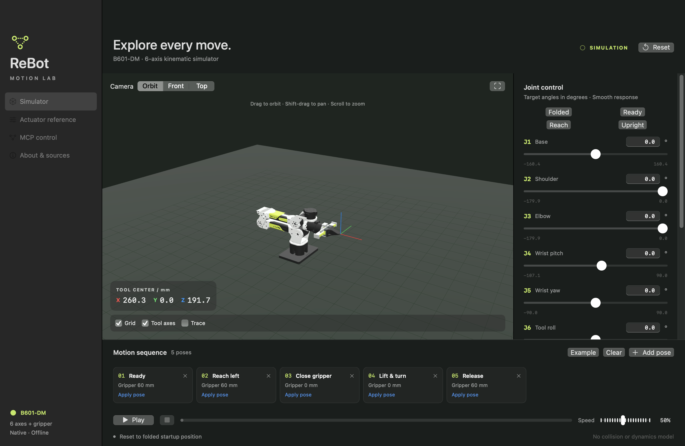
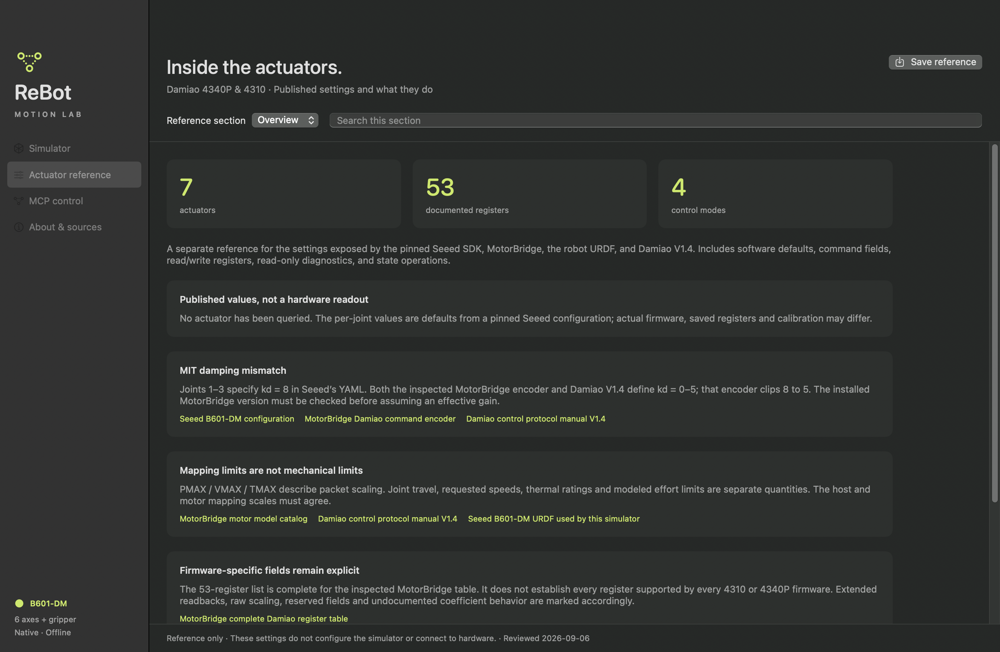

# ReBot Motion Lab

**Explore the ReBot B601-DM in a native macOS app or your browser, with MCP control for the native simulator.**

[](https://github.com/monomyth/rebot-motion-lab/actions/workflows/ci.yml)


[](LICENSE)

Move six joints and a coupled gripper, plan repeatable trajectories, inspect actuator settings, and control the simulator through MCP. The native app uses **SwiftUI, AppKit, and RealityKit**, with robot geometry and reference material bundled for offline use. The browser app uses **React and Three.js**.

[**Download for macOS**](https://github.com/monomyth/rebot-motion-lab/releases/latest) · [Build from source](#build-from-source) · [Run the web app](#web-simulator) · [MCP setup](MCP.md) · [Actuator reference](Sources/RobotCore/Resources/B601-DM-actuator-settings.md)



## One repository, three components

| Component | Source | Run it |
| --- | --- | --- |
| Native macOS app | [`Sources/ReBotMotionLab/`](Sources/ReBotMotionLab/) | `bash scripts/swift-local.sh run ReBotMotionLab` |
| Web simulator | [`web/`](web/) | `cd web && npm ci && npm run dev` |
| Native MCP server | [`Sources/ReBotMCP/`](Sources/ReBotMCP/) and [`Sources/RobotControl/`](Sources/RobotControl/) | Bundled with the native app; see [MCP setup](MCP.md) |

The repository root is the Swift package root. Open `Package.swift` in Xcode or this repository folder in Cursor. Web commands run from `web/`. Both original Git histories are retained.

## Native app features

- **Immediate manual motion.** Sliders and numeric fields apply joint and gripper values on the same event; the 3D arm tracks the control without a smoothing delay.
- **Stop at the floor.** Every moving link, both gripper fingertips, and a held scene cube respect the solid base plane. Manual controls stop at contact and reverse immediately. Presets and sequences stop at the first obstructed point.
- **Scene cube and kinematic grasp.** A 40 mm cube sits on the floor in front of the base. Closing the gripper around it to about the cube width attaches the cube to the tool; opening past that width plus 12 mm releases it. Pads stop at the cube faces. The wrist/arm cannot pass through an unattached cube. An unattached cube falls under gravity (9.81 m/s²) onto the base plane. There is no payload mass, bounce, or contact friction.
- **Fold, unfold, and position.** Start in the folded pose with a closed gripper. Choose Folded, Ready, Reach, or Upright, or solve for a tool position. Optional **Keep tool level** IK holds the tool or attached cube within 5° of world vertical.
- **Build a motion sequence.** Capture named poses, play/pause/resume, adjust speed, and import or export portable trajectory JSON.
- **Inspect the scene.** Orbit, pan, and zoom; switch camera presets; show the grid, tool axes, and TCP trace.
- **Keep the reference beside the simulator.** Browse 53 documented actuator registers, seven actuator assignments, SDK defaults, command fields, operating modes, and source links.
- **Control it through MCP.** A bundled native server exposes 18 tools and two resources, including cube placement, JPEG capture, level IK, and a servo mode for closed-loop clients. No Python or Node runtime is needed to use it.

This is a **kinematic simulator**. It enforces contact with the base plane, including the gripper fingers and a held cube. An unattached cube blocks the wrist/arm and falls onto that plane. It does not connect to robot hardware or simulate self-collisions, payload mass, bounce, torque, thermal behavior, or actuator dynamics. Published motor settings are reference data; they do not configure the simulator. A fly-brain or other neural controller belongs in an external client, not in this app.

## Get started

1. [Download the latest macOS release](https://github.com/monomyth/rebot-motion-lab/releases/latest), unzip it, and move **ReBot Motion Lab.app** to **Applications**. You can also [build from source](#build-from-source).
2. Open the app and select **Ready** to unfold the arm.
3. Adjust a joint or the gripper, then choose **Add pose** to save the displayed control values.
4. Add more poses and press **Play**. Export the sequence to keep it between sessions.

Requires **macOS 14 or later** and Metal-capable graphics. The app contains Intel and Apple silicon executables. Packaged builds are locally ad-hoc signed, not Developer ID signed or notarized; macOS may require explicit approval to open them. Building from source is also supported.

### Controls

| Action | Control |
| --- | --- |
| Orbit / pan / zoom | Drag / Shift-drag or right-drag / scroll or pinch |
| Play or pause | ⌘Return |
| Stop motion | Escape |
| Reset to folded startup | ⌘R |
| Add the displayed pose | ⌘K |
| Import / export trajectory | ⌘O / ⌘S |
| Increase / decrease text | ⌘+ or ⌘= / ⌘− |
| Reset text size | ⌘0 |

Text size persists from 80% to 160%. Joint and gripper controls apply the permitted pose immediately and stop before any moving mesh crosses the floor. The TCP readout may refresh at 15 Hz during a drag. Stop freezes playback. Reset and presets discard slider tracking. Leaving the simulator pauses playback and ends slider tracking.

The [example trajectory](examples/trajectory.json) uses the same `rebot-motion-lab-v1` format as the original browser prototype: six joint angles in degrees, gripper opening in millimeters, and playback speed from 10–100%. Waypoints stay in memory until exported.

## Actuator reference

A separate view explains the documented settings and what they do. It includes 53 registers, 30 SDK settings, 11 command fields, four control modes, ten operations, status codes, and pinned primary sources. Search within sections and filter registers by category, or export the complete Markdown reference from the app.



The reference preserves differences between source versions. For example, Seeed's J1–J3 MIT-mode `kd = 8` is clipped to 5 by the inspected encoder. Defaults are not live device readings, and protocol mapping ranges are not mechanical joint limits. See the [full reference](Sources/RobotCore/Resources/B601-DM-actuator-settings.md) for details.

## Connect an MCP client

Open **MCP control** in the sidebar to enable access and copy a configuration for the app's current location.

The on-screen preview hides your private install directory. The Copy button includes the actual path so the client can launch the helper.

With the app in Applications, a standard stdio configuration is:

```json
{
  "mcpServers": {
    "rebot-motion-lab-grok": {
      "command": "/Applications/ReBot Motion Lab.app/Contents/MacOS/ReBotMCP",
      "args": []
    }
  }
}
```

Try: *“Unfold the robot to Ready, rotate joint 1 to 30 degrees, then close the gripper.”* Cube and capture: *“Show the Top camera, place the cube at 280 mm, and capture a 320×240 view.”*

The helper can launch the app. Tools return when a move is accepted; clients read state until it finishes. All control stays on the same Mac through a private Unix socket. MCP is enabled by default and can be disabled in the app. It controls this simulator only.

See [MCP.md](MCP.md) for the complete tool list, Codex registration, motion workflow, units, error handling, and transport details. A reusable [configuration example](examples/mcp.json) is included.

## Build from source

Use Xcode 16 or later, or Apple Command Line Tools with Swift 6. There are **no third-party Swift package dependencies**.

```sh
git clone https://github.com/monomyth/rebot-motion-lab.git
cd rebot-motion-lab

# Run the native app.
bash scripts/swift-local.sh run ReBotMotionLab

# Run the core and protocol tests.
bash scripts/swift-local.sh test

# Build a universal macOS application.
bash scripts/build-app.sh ./dist
open "dist/ReBot Motion Lab.app"
```

In Xcode, open `Package.swift`, choose **ReBotMotionLab**, and run on **My Mac**. This project targets macOS; an iOS app is not included.

The wrapper handles a known Command Line Tools manifest-interface mismatch within the build directory; it never changes the installed Apple toolchain. On a matching Xcode installation, `swift run` and `swift test` also work directly.

See [Development](docs/DEVELOPMENT.md) for app-level checks, packaging, architecture, and reproducible validation. [PERFORMANCE.md](PERFORMANCE.md) documents the motion implementation and measured local samples.

## Web simulator

Requires Node.js 22.13 or later. The web app can build and run on macOS, Linux, or Windows; the native Swift app requires macOS because it uses Apple UI and graphics frameworks.

```sh
cd web
npm ci
npm run dev
```

Open the local URL printed by the server. Use `npm test`, `npm run typecheck`, and `npm run build` to validate a change. See the [web README](web/README.md) for controls and deployment details. The native MCP server currently controls the macOS app; it is not a browser-control endpoint.

## Project layout

The Swift package and native MCP server stay at the root; the complete browser simulator is under `web/`. There are no nested Git repositories or submodules.

```text
Package.swift     Native macOS app and MCP package
Sources/
  RobotCore/       Kinematics, motion, model assets, and actuator data
  ReBotMotionLab/  SwiftUI interface and RealityKit scene
  RobotControl/    MCP protocol, tool validation, and private IPC
  ReBotMCP/        Native stdio server and app launch helper
web/              Browser UI, Three.js model, actuator reference, and web tests
Tests/            Core, floor contact, motion, mesh, and protocol tests
examples/         Importable trajectory and MCP configuration
docs/             Development guide and native screenshots
scripts/          Build, packaging, and integration checks
```

## Contributing

Bug reports, documentation corrections, and focused pull requests are welcome. Include the app/macOS version and a short reproduction for motion issues. See [CONTRIBUTING.md](CONTRIBUTING.md) for setup and validation guidance, and [CHANGELOG.md](CHANGELOG.md) for the current release.

## License and credits

The application code, scripts, and original documentation use the **[MIT License](LICENSE)**. MIT keeps reuse straightforward while requiring preservation of the copyright and license notice.

The bundled robot model has a separate license: Seeed's URDF/STL assets and their `model.json` conversion remain under **CERN-OHL-W-2.0**. MotorBridge-derived metadata retains its **MIT** notice. These materials are not relicensed by the application's MIT license. See [THIRD_PARTY_NOTICES.md](THIRD_PARTY_NOTICES.md) for exact paths, pinned sources, and license texts.

Robot model: [Seeed-Projects/reBot-DevArm](https://github.com/Seeed-Projects/reBot-DevArm). Actuator metadata: [MotorBridge](https://github.com/motorbridge/motorbridge) and the pinned sources in the reference. This is an independent project, not an official Seeed or Damiao product.
